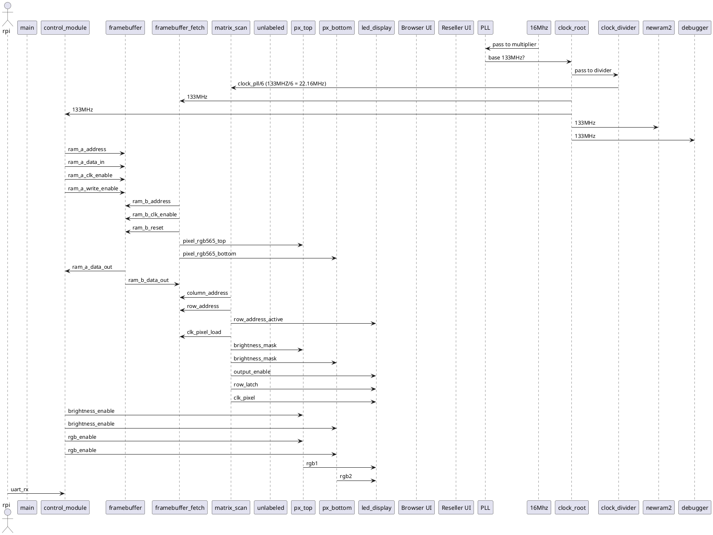

```plantuml
@startuml
/'autonumber'/
actor rpi as rpi
participant "main" as main
participant "control_module" as control_module
participant "framebuffer" as framebuffer
participant "framebuffer_fetch" as framebuffer_fetch
participant "matrix_scan" as matrix_scan
participant "unlabeled" as unlabeled
participant "px_top" as px_top
participant "px_bottom" as px_bottom
participant "led_display" as led_display
participant "Browser UI" as browser
participant "Reseller UI" as reseller_ui
participant "PLL" as clock_PLL
participant "16Mhz" as clock_16mhz
participant "clock_root" as clock_root
participant "clock_divider" as clock_divider
participant "newram2" as newram2
participant "debugger" as debugger

clock_16mhz -> clock_PLL : pass to multiplier
clock_PLL -> clock_root : base 133MHz?
clock_root -> clock_divider : pass to divider
clock_divider -> matrix_scan : clock_pll/6 (133MHZ/6 = 22.16MHz)
clock_root -> framebuffer_fetch: 133MHz
clock_root -> control_module: 133MHz
clock_root -> newram2: 133MHz
clock_root -> debugger: 133MHz

control_module -> framebuffer : ram_a_address
control_module -> framebuffer : ram_a_data_in
control_module -> framebuffer : ram_a_clk_enable
control_module -> framebuffer : ram_a_write_enable
framebuffer_fetch -> framebuffer : ram_b_address
framebuffer_fetch -> framebuffer : ram_b_clk_enable
framebuffer_fetch -> framebuffer : ram_b_reset
framebuffer_fetch -> px_top : pixel_rgb565_top
framebuffer_fetch -> px_bottom : pixel_rgb565_bottom
framebuffer -> control_module: ram_a_data_out
framebuffer -> framebuffer_fetch: ram_b_data_out
matrix_scan -> framebuffer_fetch: column_address
matrix_scan -> framebuffer_fetch: row_address
matrix_scan -> led_display: row_address_active
matrix_scan -> framebuffer_fetch: clk_pixel_load
matrix_scan -> px_top: brightness_mask
matrix_scan -> px_bottom: brightness_mask
matrix_scan -> led_display: output_enable
matrix_scan -> led_display: row_latch
matrix_scan -> led_display: clk_pixel
control_module -> px_top: brightness_enable
control_module -> px_bottom: brightness_enable
control_module -> px_top: rgb_enable
control_module -> px_bottom: rgb_enable
px_top -> led_display: rgb1
px_bottom -> led_display: rgb2
rpi -> control_module: uart_rx

@enduml
```