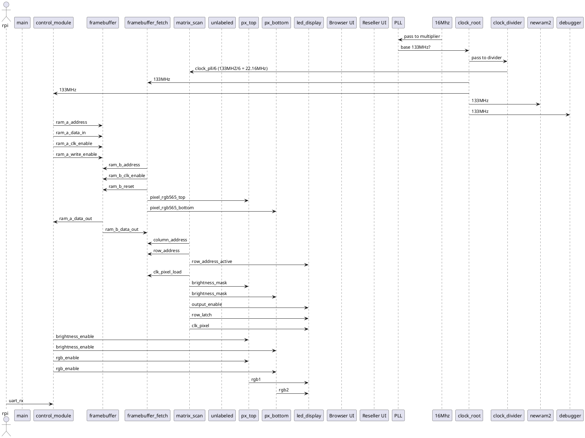

```plantuml
@startuml
/'autonumber'/
/'
	framebuffer_fetch fb_f (
		.reset(global_reset),
		.clk_in(clk_root),

		.column_address(column_address),
		.row_address(row_address),
		.pixel_load_start(clk_pixel_load),

		.ram_data_in(ram_b_data_out),
		.ram_address(ram_b_address),
		.ram_clk_enable(ram_b_clk_enable),
		.ram_reset(ram_b_reset),

		.rgb565_top(pixel_rgb565_top),
		.rgb565_bottom(pixel_rgb565_bottom)
	);
module framebuffer_fetch (
	input reset,
	input clk_in,

	input [5:0] column_address,
	input [3:0] row_address,

	input pixel_load_start,

	input [15:0] ram_data_in,
	output [10:0] ram_address,
	output ram_clk_enable,
	output ram_reset,

	output reg [15:0] rgb565_top,
	output reg [15:0] rgb565_bottom
);
	matrix_scan matscan1 (
		.reset(global_reset),
		.clk_in(clk_matrix),
		.column_address(column_address),
		.row_address(row_address),
		.row_address_active(row_address_active),#
		.clk_pixel_load(clk_pixel_load),#
		.clk_pixel(clk_pixel) #
		.row_latch(row_latch), #
		.output_enable(output_enable) # ,
		.brightness_mask(brightness_mask)
	);

module matrix_scan (
	input reset,
	input clk_in,

	output [5:0] column_address,         /* the current column (clocking out now) */
	output reg [3:0] row_address,        /* the current row (clocking out now) */
	output reg [3:0] row_address_active, /* the active row (LEDs enabled) */

	output clk_pixel_load,
	output clk_pixel,
	output row_latch,
	output output_enable, /* the minimum output enable pulse should not be shorter than 1us... */

	output reg [5:0] brightness_mask /* used to pick a bit from the sub-pixel's brightness */

    module pixel_split (
	input [15:0] pixel_rgb565,
	input [5:0] brightness_mask,
	input [2:0] rgb_enable,
	output [2:0] rgb_output
}
	pixel_split px_top (
		.pixel_rgb565(pixel_rgb565_top),
		.brightness_mask(brightness_mask & brightness_enable),
		.rgb_enable(rgb_enable),
		.rgb_output(rgb1)
	);
	pixel_split px_bottom (
		.pixel_rgb565(pixel_rgb565_bottom),
		.brightness_mask(brightness_mask & brightness_enable),
		.rgb_enable(rgb_enable),
		.rgb_output(rgb2)
	);
module control_module #(
	/* UART configuration */
	//parameter UART_CLK_DIV_COUNT = 30, /* 7 MHz in / 60 = ~115,200 baud (actually ~116,686 baud, +1.29%) */
	//parameter UART_CLK_DIV_COUNT = 231, /* 53.2 MHz in / 462 = ~115,200 baud (actually ~115,151 baud, -0.04%) */
	//parameter UART_CLK_DIV_COUNT = 10, /* 53.2 MHz in / 21 = ~2.5 Mbaud (actually 2.66 Mbaud) */
	parameter UART_CLK_DIV_COUNT = 25, /* 133 MHz in / 50 = ~2.5 Mbaud (actually 2.66 Mbaud) */
	parameter UART_CLK_DIV_WIDTH = 8
) (
	input reset,
	input clk_in,

	input uart_rx,
	output rx_running,

	output reg [2:0] rgb_enable = 3'b111,
	output reg [5:0] brightness_enable = 6'b111111,

	input [7:0] ram_data_in,
	output reg [7:0] ram_data_out,
	output reg [11:0] ram_address,
	output reg ram_write_enable,
	output ram_clk_enable,
	output ram_reset

    	control_module ctrl (
		.reset(global_reset),
		.clk_in(clk_root),

		.uart_rx(uart_rx),
		.rx_running(rx_running),

		.rgb_enable(rgb_enable),
		.brightness_enable(brightness_enable),

		.ram_data_in(ram_a_data_out),
		.ram_data_out(ram_a_data_in),
		.ram_address(ram_a_address),
		.ram_write_enable(ram_a_write_enable),
		.ram_clk_enable(ram_a_clk_enable),
		.ram_reset(ram_a_reset)
	);
'/
actor rpi as rpi
participant "main" as main
participant "control_module" as control_module
participant "framebuffer" as framebuffer
participant "framebuffer_fetch" as framebuffer_fetch
participant "matrix_scan" as matrix_scan
participant "unlabeled" as unlabeled
participant "px_top" as px_top
participant "px_bottom" as px_bottom
participant "led_display" as led_display
participant "Browser UI" as browser
participant "Reseller UI" as reseller_ui
participant "PLL" as clock_PLL
participant "16Mhz" as clock_16mhz
participant "clock_root" as clock_root
participant "clock_divider" as clock_divider
participant "newram2" as newram2
participant "debugger" as debugger

clock_16mhz -> clock_PLL : pass to multiplier
clock_PLL -> clock_root : base 133MHz?
clock_root -> clock_divider : pass to divider
clock_divider -> matrix_scan : clock_pll/6 (133MHZ/6 = 22.16MHz)
clock_root -> framebuffer_fetch: 133MHz
clock_root -> control_module: 133MHz
clock_root -> newram2: 133MHz
clock_root -> debugger: 133MHz

control_module -> framebuffer : ram_a_address
control_module -> framebuffer : ram_a_data_in
control_module -> framebuffer : ram_a_clk_enable
control_module -> framebuffer : ram_a_write_enable
framebuffer_fetch -> framebuffer : ram_b_address
framebuffer_fetch -> framebuffer : ram_b_clk_enable
framebuffer_fetch -> framebuffer : ram_b_reset
framebuffer_fetch -> px_top : pixel_rgb565_top
framebuffer_fetch -> px_bottom : pixel_rgb565_bottom
framebuffer -> control_module: ram_a_data_out
framebuffer -> framebuffer_fetch: ram_b_data_out
matrix_scan -> framebuffer_fetch: column_address
matrix_scan -> framebuffer_fetch: row_address
matrix_scan -> led_display: row_address_active
matrix_scan -> framebuffer_fetch: clk_pixel_load
matrix_scan -> px_top: brightness_mask
matrix_scan -> px_bottom: brightness_mask
matrix_scan -> led_display: output_enable
matrix_scan -> led_display: row_latch
matrix_scan -> led_display: clk_pixel
control_module -> px_top: brightness_enable
control_module -> px_bottom: brightness_enable
control_module -> px_top: rgb_enable
control_module -> px_bottom: rgb_enable
px_top -> led_display: rgb1
px_bottom -> led_display: rgb2
rpi -> control_module: uart_rx

@enduml
```